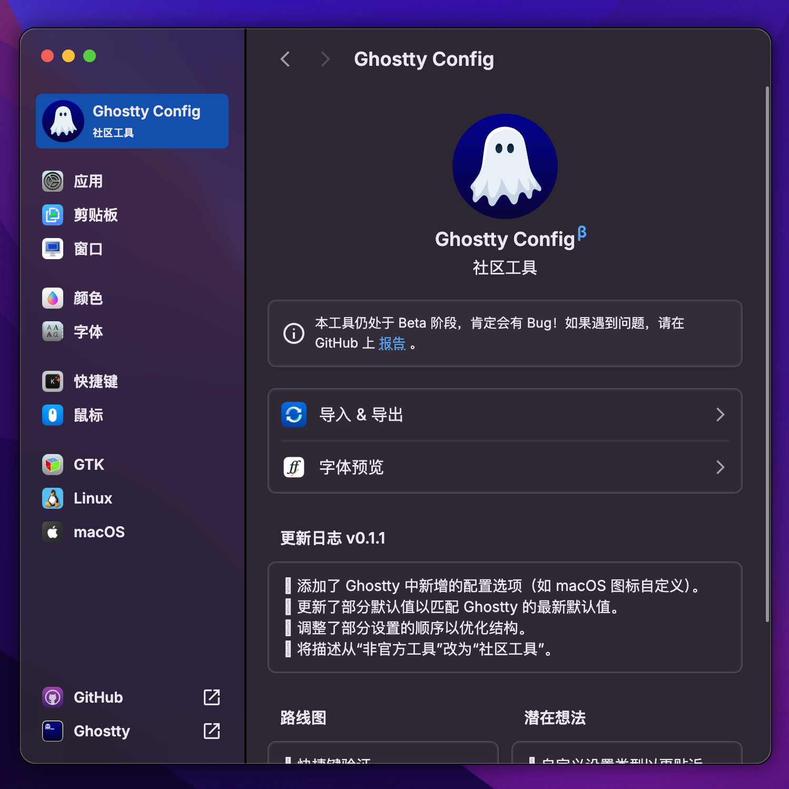

  
  <h1 align="center">Ghostty Config</h1>

> [!NOTE]
> 本工具仍处于早期开发阶段，功能列表和未来改进尚不完整——甚至连名字都还有待商榷！请通过 [GitHub Issue](https://github.com/zerebos/ghostty-config/issues) 反馈您的意见、想法并报告 Bug。

Ghostty Config 是一个为 [Ghostty Terminal](https://github.com/ghostty-org) 打造的精美配置生成器。功能包括轻松修改设置、字体演练场，以及用于光标、选区甚至调色板的大量预览和演示。更多功能即将推出，包括快捷键验证。

> 🌏 **说明**：本项目前端界面已进行简体中文汉化，旨在方便中文用户使用。

  

这是一个 Web 工具，每次推送到 `main` 分支时都会通过 GitHub Actions 自动部署，以确保保持最新状态。您可以通过此 URL 查看和分享最新版本：[ghostty.zerebos.com](https://ghostty.zerebos.com/)。

由于本工具旨在与桌面版 Ghostty 终端配合使用，因此在移动设备上的体验不佳，且目前没有适配计划。至于桌面版，如果需求足够大，我可能会通过 [Wails](https://wails.io/) 制作一个针对桌面优化的替代版本！
